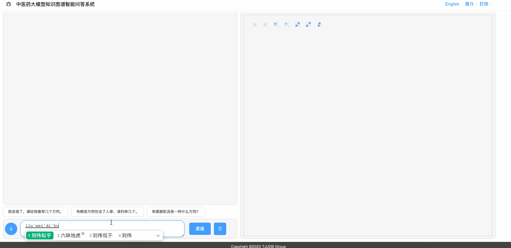
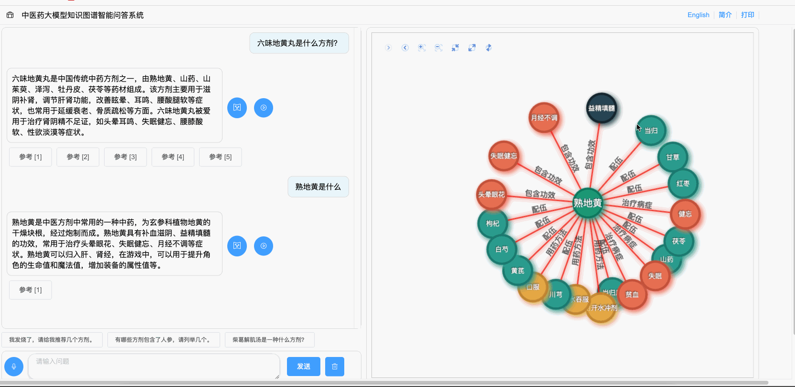
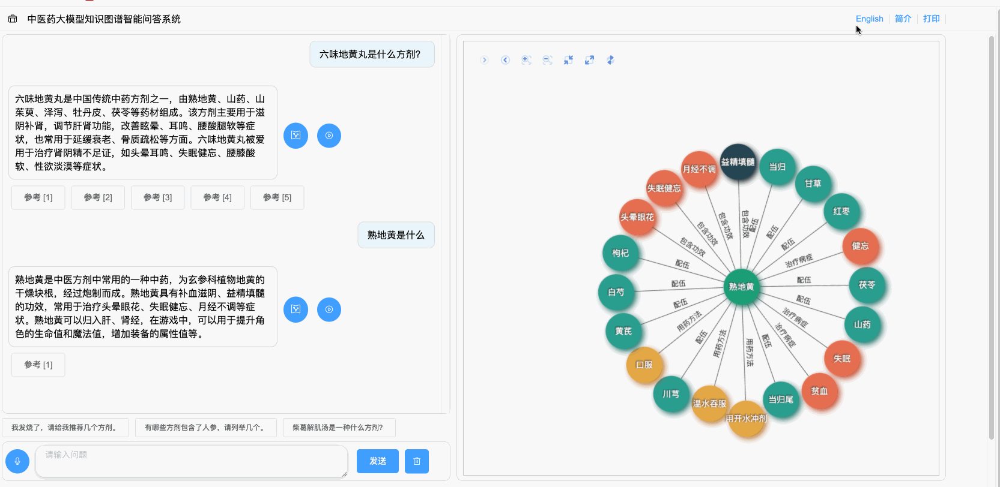

# ISWC2023-Posters-Demos-video

The integration of Large Language Models (LLMs) and Knowledge Graphs (KGs) has emerged as a vibrant research area in the field of Natural Language Processing (NLP). However, existing approaches need help effectively harnessing the complementary strengths of LLMs and KGs. In this paper, we propose a novel system that addresses this gap by enabling bidirectional conversion between LLMs and KGs. We leverage external knowledge to enhance LLMs for domain-specific responses and fine-tune LLMs for information extraction to construct the Knowledge Graph. Moreover, users can interact with the KG, initiating new rounds of questioning in LLMs. The evaluation results highlight the effectiveness of our approach. Our system showcases the potential of combining LLMs and KGs, paving the way for advanced natural language understanding and generation in various domains.
The demonstration video of the system can be accessed at https://youtu.be/T0S8ahNAk2w

## LLM to KG

## KG to LLM

## Print Message

## 中/Eng Language Support

